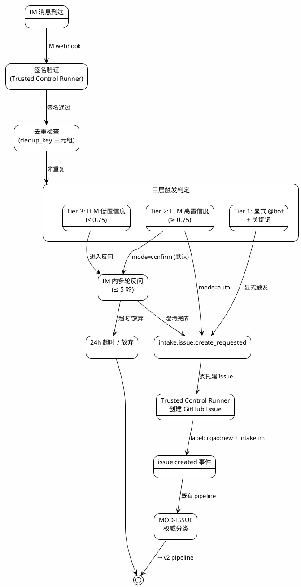
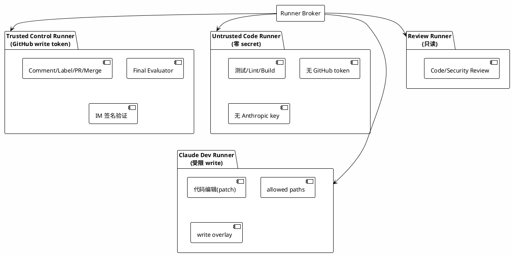

# GithubAutoDev (akushonkamen/CGAO) 全流程深度分析

> **分析日期**: 2026-07-08
> **源仓库**: https://github.com/akushonkamen/GithubAutoDev
> **分析版本**: main 分支 (commit 最新)
> **内部代号**: CGAO — Claude GitHub Automation Orchestrator

---

## 目录

1. [项目概述](#1-项目概述)
2. [架构全景](#2-架构全景)
3. [核心设计原则](#3-核心设计原则)
4. [模块详解](#4-模块详解)
5. [安全模型](#5-安全模型)
6. [数据流与状态机](#6-数据流与状态机)
7. [Runner 体系](#7-runner-体系)
8. [IM Intake 模块 (v3)](#8-im-intake-模块-v3)
9. [数据库设计](#9-数据库设计)
10. [部署架构](#10-部署架构)
11. [开发成熟度评估](#11-开发成熟度评估)

---

## 1. 项目概述

GithubAutoDev（内部代号 CGAO — Claude GitHub Automation Orchestrator）是一个**围绕 Claude Code + GitHub 的 SDLC 全流程自动化编排器**。它把 issue 创建 → 分析 → 规划 → 开发 → 测试 → PR → 审查 → 合入的全流程自动化，每个模块松耦合、事件驱动、状态权威可审计。

### 1.1 核心定位

| 维度 | 描述 |
|------|------|
| **类型** | 独立部署的后端服务（非插件） |
| **触发方式** | GitHub Webhook 事件驱动 + IM (飞书/企业微信) 入口 |
| **运行模式** | 7×24 常驻服务，自动响应事件 |
| **用户交互** | GitHub Issue Comment 命令 + IM 对话 |
| **目标用户** | 有 GitHub 仓库的中文开发团队 |

### 1.2 版本演进

```
v1 (初始版本)
  └─ 基础 issue → PR 流程

v2 (安全硬化)
  ├─ 红蓝军挑战结果合并
  ├─ SHA-bound gates
  ├─ Trusted/Untrusted runner 拆分
  ├─ Origin suppression（防自循环）
  ├─ Reconciler（状态校准）
  ├─ Filesystem sandbox
  └─ Merge final evaluator (TOCTOU 防御)

v3 (IM Intake 扩展，当前版本)
  ├─ MOD-INTAKE：飞书 + 企业微信入口
  ├─ 三层触发策略（显式 / LLM高置信度 / LLM低置信度多轮反问）
  ├─ Advisory 分类（不绕过 MOD-ISSUE）
  └─ 完全追加性改动，不修改任何 v2 模块
```

### 1.3 技术栈

| 层级 | 技术选型 |
|------|---------|
| 语言 | TypeScript (Node.js ≥ 20) |
| 包管理 | pnpm workspaces (monorepo) |
| HTTP 框架 | Hono |
| 数据库 | PostgreSQL + Drizzle ORM |
| 事件总线 | EventBus 抽象（内存/Postgres/NATS） |
| Schema 校验 | Zod |
| 测试 | Vitest |
| Lint/Format | Biome |
| GitHub SDK | Octokit |
| AI 执行 | Claude Code (via Agent SDK / GitHub Actions) |
| 可观测性 | OpenTelemetry + Prometheus + 结构化日志 |

---

## 2. 架构全景

### 2.1 系统拓扑

```plantuml
@startuml
!theme plain
skinparam backgroundColor #FEFEFE
skinparam componentStyle rectangle

actor "GitHub User" as User
actor "IM User\n(飞书/WeCom)" as IMUser
actor "Maintainer" as Maint

package "GitHub" {
  [Issues / PRs / Reviews] as GitHubRepo
  [Branch Protection] as BranchProt
  [Merge Queue] as MergeQ
}

package "IM Platform\n(飞书 / 企业微信)" as IMPlatform {
  [Bot Webhook] as IMBot
}

package "CGAO System" as CGAO {
  
  package "Webhook Gateway" as WG {
    [Signature Verification] as SigVerify
    [Delivery Dedup] as Dedup
    [Event Normalizer] as Normalizer
    [Origin Suppression] as OriginSupp
  }
  
  package "Event Bus" as EB {
    [Event Router] as Router
    [Event Store] as EventStore
  }
  
  package "Orchestrator Core" as Core {
    [MOD-INTAKE\n(IM入口)] as Intake
    [MOD-ISSUE\n(Issue管理)] as Issue
    [MOD-ANALYSIS\n(需求分析)] as Analysis
    [MOD-PLAN\n(规划)] as Plan
    [MOD-DEV\n(开发)] as Dev
    [MOD-TEST\n(测试)] as Test
    [MOD-PR\n(PR管理)] as PR
    [MOD-REVIEW\n(审查)] as Review
    [MOD-MERGE\n(合入)] as Merge
    [MOD-POLICY\n(策略)] as Policy
    [MOD-RECONCILER\n(状态校准)] as Reconciler
  }
  
  package "Runner Infrastructure" as Runners {
    [Runner Broker] as Broker
    [Trusted Control\nRunner] as TCR
    [Untrusted Code\nRunner] as UCR
    [Claude Dev\nRunner] as CDR
    [Review Runner] as RR
  }
  
  package "Persistence" as Persist {
    [PostgreSQL\n(State)] as PG
    [Artifact Store\n(S3/MinIO)] as ArtStore
    [Audit Chain] as AuditChain
  }
}

User --> GitHubRepo : opens issue / comments
Maint --> GitHubRepo : /approve-plan / merge
IMUser --> IMBot : @bot 需求/报bug
IMBot --> SigVerify : webhook
GitHubRepo --> SigVerify : webhook events
SigVerify --> Dedup
Dedup --> Normalizer
Normalizer --> OriginSupp
OriginSupp --> Router

Router --> Intake
Router --> Issue
Router --> Analysis
Router --> Plan
Router --> Dev
Router --> Test
Router --> PR
Router --> Review
Router --> Merge
Router --> Reconciler

Intake --> Issue : issue.created
Issue --> Analysis
Analysis --> Plan
Plan --> Dev
Dev --> TCR : control actions
Dev --> CDR : code changes
Dev --> Test
Test --> UCR : no-secret tests
Test --> PR
PR --> Review
Review --> RR : code/security review
Review --> Merge
Merge --> TCR : merge decision

Broker --> TCR
Broker --> UCR
Broker --> CDR
Broker --> RR

Core --> PG : state read/write
Core --> ArtStore : evidence storage
Core --> AuditChain : audit records
TCR --> GitHubRepo : write (comment/label/PR)
Merge --> BranchProt : check
Merge --> MergeQ : enqueue
@enduml
```

### 2.2 仓库结构

```
cgao/
├── apps/
│   ├── orchestrator/          # 编排服务（核心）— M0/M1 已实现
│   │   ├── src/
│   │   │   ├── config/        # .cgao.yml 解析与校验
│   │   │   ├── adapters/      # git 子进程适配器
│   │   │   ├── webhook/       # GitHub webhook 处理
│   │   │   ├── modules/
│   │   │   │   ├── intake/     # MOD-INTAKE (v3)
│   │   │   │   ├── issues/     # MOD-ISSUE: triage/classify/status
│   │   │   │   ├── specs/      # MOD-ANALYSIS + MOD-PLAN
│   │   │   │   ├── branches/   # 分支管理
│   │   │   │   ├── commits/    # Commit 构建
│   │   │   │   ├── prs/        # MOD-PR
│   │   │   │   ├── review/     # MOD-REVIEW
│   │   │   │   ├── merge/      # MOD-MERGE (最复杂模块)
│   │   │   │   ├── reconcile/  # MOD-RECONCILER
│   │   │   │   ├── budget/     # 成本与速率控制
│   │   │   │   ├── commands/   # 命令授权解析
│   │   │   │   ├── repos/      # 仓库注册与安装解析
│   │   │   │   ├── runner/     # Runner 调度
│   │   │   │   ├── policy/     # MOD-POLICY
│   │   │   │   └── observability/
│   │   │   ├── server.ts       # Hono HTTP 入口
│   │   │   ├── runtime.ts      # 运行时引导
│   │   │   └── index.ts
│   │   └── __tests__/          # 每个模块均有测试
│   │
│   ├── runner-broker/         # Runner 代理服务
│   │   ├── src/
│   │   │   ├── sdk/           # Claude Agent SDK 封装
│   │   │   ├── sandbox/       # 文件系统沙箱
│   │   │   ├── gate/          # Gate 运行器 (fast gate/test-fix/verifier)
│   │   │   ├── worktree/      # Git worktree 管理
│   │   │   ├── profiles/      # Credential profiles
│   │   │   ├── policy/        # 运行期策略 hook
│   │   │   ├── cca/           # Claude Code Action 集成
│   │   │   └── dev/           # 开发模式模块
│   │   └── __tests__/
│   │
│   └── dashboard/             # Web 仪表盘 (P2)
│
├── packages/
│   ├── db/                    # Drizzle schema + 迁移 + 仓库层
│   ├── events/                # 事件类型定义 + CloudEvents envelope
│   ├── eventbus/              # 事件总线（内存/Postgres/NATS 实现）
│   ├── github/                # Octokit 客户端 + PR port 适配器
│   ├── github-events/         # GitHub webhook → CloudEvents 映射
│   ├── schemas/               # Zod schema（config/artifact/stable-json）
│   ├── policy/                # 策略引擎（gates 定义）
│   ├── observability/         # Logger/OpenTelemetry/Prometheus
│   ├── artifacts/             # Artifact 存储（access-policy/redaction/retention）
│   ├── audit/                 # 审计链 + checkpoint
│   └── test-utils/            # 共享测试 fixtures
│
├── tests/
│   ├── e2e/                   # 端到端测试（fake git/github/runner）
│   ├── security/              # 安全回归测试
│   ├── concurrency/           # 并发测试
│   └── fixtures/              # 测试固件
│       ├── malicious-issues/  # 恶意 issue 注入测试
│       ├── webhook-replay/    # Webhook 重放测试
│       └── intake/            # IM Intake 测试
│
├── docs/
│   ├── cgao_spec_v3.md        # 完整系统规格 (2062 行)
│   ├── cgao_tasklist_v3.md    # 实施任务清单 (2014 行)
│   ├── cgao_v3_changelog.md   # v2→v3 变更记录
│   ├── github-app-setup.md    # GitHub App 配置指南
│   ├── security/
│   │   └── threat-model.md    # 威胁模型（23 攻击向量）
│   ├── standards/             # 错误码/事件/日志规范
│   └── audit/                 # 审计报告
│
├── attack-scenarios/          # 攻击场景文档 (4篇)
├── infra/
│   └── docker-compose.yml     # 开发基础设施
├── .github/workflows/         # CI + CGAO Runner workflows
├── fixtures/config/           # 示例 .cgao.yml 配置
└── .cgao.yml.example          # 配置模板
```

### 2.3 代码规模

| 类别 | 规模 |
|------|------|
| TypeScript 源文件 (不含测试) | ~150 文件 |
| TypeScript 总代码行数 | ~20,000 行 |
| 测试文件 | ~50 文件 (e2e/安全/并发/单元) |
| 规格文档 | ~4,000 行 Markdown |
| packages (共享库) | 12 个包 |
| apps (应用) | 3 个应用 |
| 数据库迁移 | 初始迁移 (15+ 表) |

---

## 3. 核心设计原则

### 3.1 十大原则

| # | 原则 | 说明 |
|---|------|------|
| 1 | **松耦合** | 模块只通过事件总线通信，不直接调用 |
| 2 | **状态权威性** | Orchestrator DB 是流程状态源，GitHub 只是投影 |
| 3 | **事件只是触发器** | Webhook payload 只作触发信号，处理前必须 re-hydrate GitHub 当前状态 |
| 4 | **幂等** | 所有事件处理可重复执行，每个操作都有幂等键 |
| 5 | **SHA-bound gate** | 需求/计划/审批/实现/测试/审查/合入通过 hash 链绑定 |
| 6 | **有界自治** | 自动修复 ≤ 5 轮，同一失败 fingerprint 3 次阻断 |
| 7 | **角色隔离** | 分析/开发/测试/审查必须不同角色，实现 agent 不能最终审批 |
| 8 | **最小权限** | 代码执行 runner 无 GitHub write token、无 Anthropic key、无长期 secret |
| 9 | **Artifact 优先** | 所有证据保存为不可变 Artifact，GitHub 评论只展示摘要 |
| 10 | **安全规则写进代码** | 路径权限/命令权限/合入 gate/修复上限等由代码强制执行，不靠 prompt |

### 3.2 OMC 理念映射

该项目深受 [oh-my-claudecode](https://github.com/RankoHata/oh-my-claudecode) (OMC) 理念影响：

```
OMC Hooks    → GitHub Webhook / Actions Event / Runner Hook / Policy Hook
OMC Skills   → Workflow Capability / Orchestration Policy
OMC Agents   → Claude Code Worker Role
OMC State    → Orchestrator State Store + Artifact Store + Audit Chain
OMC UltraQA  → 有界 test-fix-verification 循环
OMC Team     → 多 worker / worktree / handoff 协作模式
```

---

## 4. 模块详解

### 4.0 MOD-INTAKE：IM 入口模块（v3 新增）

**职责**：从飞书/企业微信 IM 群接收口语化需求/bug 反馈，转为 well-formed GitHub issue。

**核心流程**：



**三层触发策略**：
- **Tier 1 (显式触发)**: `@bot` + 关键词词典，无条件建 issue
- **Tier 2 (LLM 高置信度)**: 未显式 @bot，LLM 判定 ≥ 0.75
- **Tier 3 (LLM 低置信度)**: LLM 判定 < 0.75，启动多轮反问

**关键约束**：
- Intake 的 LLM 分类只是 `classification_hint`（advisory）
- IM 消息**不是**命令源
- IM 消息原文以 untrusted content envelope 包裹

### 4.1 MOD-WEBHOOK：Webhook Gateway

**处理管道** (6 步):
1. HMAC-SHA256 签名验证（constant-time）
2. Delivery ID 去重（24h 窗口）
3. CloudEvents 标准化映射
4. Origin Suppression（防自循环）
5. Raw payload → Artifact Store
6. Event Bus 发布

### 4.2 MOD-ISSUE：Issue 管理模块

核心类: `IssueClassifier`, `InformationCompletenessRules`, `StatusProjectionService`, `IssueTriageService`

支持命令: `/approve-plan`, `/revise-plan`, `/retry`, `/cancel`, `/block`, `/resume`, `/merge-ready`, `/manual-only`, `/trust-run`

### 4.3-4.11 其他模块概要

| 模块 | 核心职责 |
|------|---------|
| MOD-ANALYSIS | 生成 `RequirementSpec`（目标/验收/风险），untrusted envelope |
| MOD-PLAN | 生成 `ImplementationPlan`（任务拆分/风险/quality gates/merge policy） |
| MOD-DEV | 创建分支、调度 Runner、输出 validated patch |
| MOD-TEST | 有界修复循环（≤5轮），fast/standard/high_risk gates |
| MOD-PR | 幂等 PR 创建，traceability block，HMAC marker |
| MOD-REVIEW | 双轨审查（code + security），finding lifecycle 管理 |
| MOD-MERGE | 最复杂模块：GateAggregator + FinalEvaluator + MergeGroupHandler + MergeQueueAdapter |
| MOD-RECONCILER | 周期扫描 + drift 检测 + 自动修复 |
| MOD-POLICY | Protected files 检测 + 风险升级 + SCA hook |

---

## 5. 安全模型

### 5.1 信任边界表

| 来源 | 信任等级 | 处理方式 |
|------|:---:|------|
| GitHub issue body / comment | 不可信 | 不可作为指令 |
| PR diff | 不可信代码 | 只在无 secret sandbox 中执行 |
| Orchestrator DB | **内部状态源** | 事务 + 锁 + audit chain |
| Artifact Store | **内部证据源** | 写入前脱敏 |
| IM 消息正文 | 不可信 | 经 untrusted envelope |
| Intake classification_hint | **半可信 advisory** | 权威分类由 MOD-ISSUE 给出 |

### 5.2 攻击面覆盖 (23 攻击向量)

包括 Prompt injection、伪造 marker、旧 plan 复用、webhook 重放、origin suppression 绕过、package script exfiltration、TOCTOU merge、IM 特有攻击等。

### 5.3 蓝军强制控制 (P0)

Trusted/Untrusted 分离、SHA-bound gates、no-secret execution、untrusted envelope、protected files、final evaluator、origin suppression、命令授权等 14 项硬控制。

---

## 6. 数据流与状态机

### 6.1 状态机 (31 状态 + 8 等待 + 10 异常)

```plantuml
@startuml
!theme plain
skinparam backgroundColor #FEFEFE

[*] --> INTAKE_RECEIVED : IM webhook (v3)
INTAKE_RECEIVED --> INTAKE_CONFIRMING : LLM低置信度
INTAKE_RECEIVED --> INTAKE_READY : 显式触发/LLM高置信度
INTAKE_CONFIRMING --> INTAKE_READY : 澄清完成
INTAKE_CONFIRMING --> DROPPED : 超时/放弃

[*] --> NEW : GitHub issue.created
INTAKE_READY --> NEW : 建 issue

NEW --> TRIAGING --> NEEDS_INFO : 信息不足
TRIAGING --> READY_FOR_ANALYSIS : 信息完备
NEEDS_INFO --> TRIAGING : 补充信息
READY_FOR_ANALYSIS --> ANALYZING --> ANALYSIS_READY
ANALYSIS_READY --> PLANNING --> PLAN_READY
PLAN_READY --> WAITING_PLAN_APPROVAL --> APPROVED_FOR_DEV
APPROVED_FOR_DEV --> IMPLEMENTING --> TESTING
TESTING --> FIXING : 失败
FIXING --> TESTING : 修复
TESTING --> PR_PREPARING --> PR_READY --> REVIEWING
REVIEWING --> GATE_EVALUATING --> MERGE_READY --> MERGING --> MERGED --> CLOSED
@enduml
```

### 6.2 Generation 机制

Material input 变化 → generation++ → 旧 gen 事件只写审计

### 6.3 事件契约

30+ CloudEvents topics: `issue.*`, `analysis.*`, `plan.*`, `dev.*`, `test.*`, `pr.*`, `review.*`, `gate.*`, `merge.*`, `reconcile.*`, `intake.*`

---

## 7. Runner 体系

### 四种 Runner 角色



### Filesystem Sandbox

三层隔离: read-only base → write overlay (allowed paths) → forbidden path deny

### Agent 角色权限矩阵

11 种角色，从 analyst (只读) 到 merge-manager (合入执行)，每角色有不同的 tools/write/merge 权限

---

## 8. IM Intake 模块 (v3)

- 适配器: `lark.ts` (飞书) + `wecom.ts` (企业微信)
- 核心: `classifier.ts` (LLM 软判定) + `clarifier.ts` (多轮反问) + `dedup.ts` (三元组去重)
- `.cgao.yml` 配置: mode=confirm/auto/off, confidence_threshold=0.75, max_clarify_rounds=5

---

## 9. 数据库设计

15+ 张表: `workflow_runs`, `github_deliveries`, `workflow_events`, `github_mutations`, `command_authorizations`, `agent_runs`, `artifacts`, `gate_results`, `review_findings`, `policy_decisions`, `audit_records` (+ v3: `intake_sessions`, `intake_messages`, `intake_decisions`)

Audit hash chain: `hash(prev_hash + canonical_json(record))`

---

## 10. 部署架构

- **开发环境**: Docker Compose (PostgreSQL + NATS + Redis + MinIO)
- **Runtime 模式**: memory (开发) / real (生产)
- **GitHub Actions**: Event Bridge + Trusted Control + Untrusted Test + Intake Receivers

---

## 11. 开发成熟度评估

| 特征 | 评分 | 说明 |
|------|:---:|------|
| 架构设计 | ★★★★★ | 极其详尽 |
| 安全设计 | ★★★★★ | 23 攻击向量全覆盖 |
| 文档质量 | ★★★★★ | 4000+ 行规格 |
| 代码实现度 | ★★☆☆☆ | M0/M1 完成 |
| 测试覆盖 | ★★★☆☆ | 框架完善 |
| 生产就绪度 | ★☆☆☆☆ | 不可用于生产 |

---

**已实现**: Monorepo 骨架、Webhook Gateway、Issue Triage 规则引擎、Merge/Review/PR/Reconciler/Budget/Audit 全套模块代码、Runner Broker 应用

**未实现**: 模块事件订阅、状态机流转、Analysis/Plan 模块、Claude Code runner 端到端集成、GitHub Actions 部署

---

> 📁 **相关文档**: [02-cgao-comparison-analysis.md](02-cgao-comparison-analysis.md) — 与我们的 CGAO 项目的深度对比
> 
> 🤖 Generated with [Claude Code](https://claude.com/claude-code)
