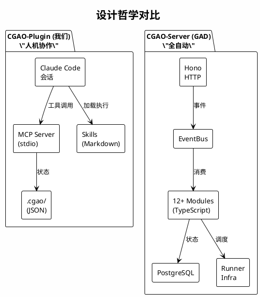
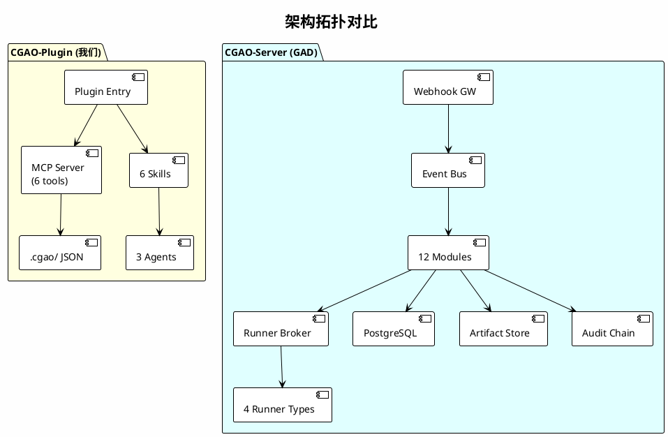
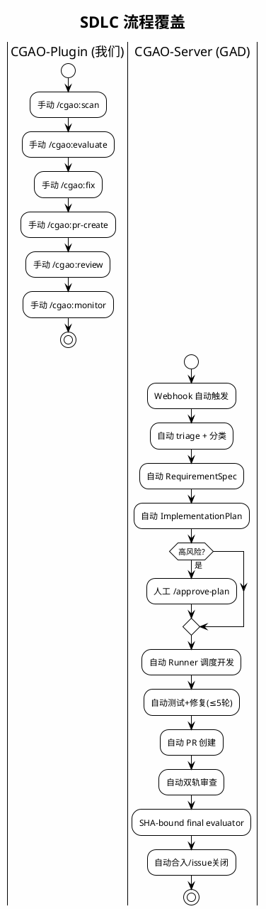
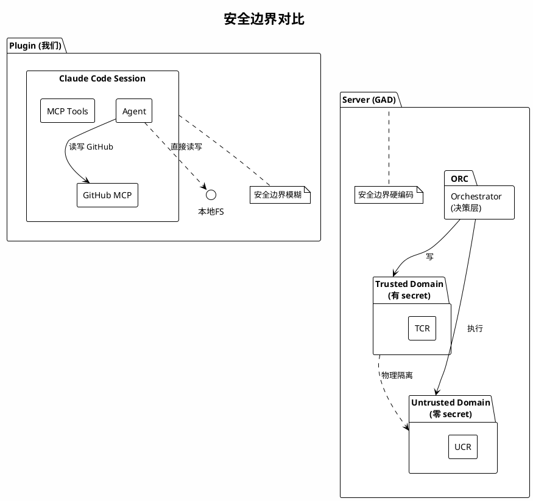

# CGAO (我们) vs GithubAutoDev (参考项目) 深度对比分析

> **日期**: 2026-07-08
> **我们**: `f:\AI\cgao` — Claude Code Plugin (CGAO-Plugin)
> **参考**: `akushonkamen/GithubAutoDev` — Standalone Server (CGAO-Server)

---

## 1. 核心定位差异

| 维度 | CGAO-Plugin (我们) | CGAO-Server (GAD) |
|------|-------------------|-------------------|
| **本质** | Claude Code **IDE 插件** | 独立**后端服务** |
| **类比** | VS Code 扩展 | CI/CD 服务器 (如 Jenkins) |
| **触发** | 用户手动 `/cgao:scan` | GitHub Webhook 自动触发 |
| **运行** | Claude Code 会话内 | 7×24 独立进程 |
| **部署** | `claude plugins install` | Docker + PostgreSQL + NATS + MinIO |
| **用户** | 单个开发者 | 整个团队 |



### 核心权衡

| 权衡 | CGAO-Plugin | CGAO-Server |
|------|:---:|:---:|
| 上手难度 | **极低** (安装即用) | 高 (需部署整套设施) |
| 自动化程度 | 低 (手动每步) | **高** (事件驱动) |
| 安全隔离 | 依赖 Claude Code | **自建** Trusted/Untrusted |
| 状态可靠性 | JSON 文件 | **PostgreSQL** |
| 运维负担 | **零** | 高 |
| 适合场景 | 个人/小团队 | 中大型团队 |

---

## 2. 架构对比



### 模块映射

| CGAO-Plugin | CGAO-Server | 关系 |
|------------|-------------|------|
| `skills/scan/` | MOD-WEBHOOK + MOD-ISSUE | 手动 vs 自动 |
| `skills/evaluate/` | MOD-ISSUE + MOD-ANALYSIS | 人工决策 vs 自动分类 |
| `skills/fix/` | MOD-PLAN + MOD-DEV | Claude Code Agent vs 独立 Runner |
| `skills/pr-create/` | MOD-PR + MOD-TEST | 手动质量检查 vs 自动 gate |
| `skills/review/` | MOD-REVIEW | 单次 vs 双轨持续 |
| `skills/monitor/` | MOD-MERGE + MOD-RECONCILER | 轮询 vs 事件驱动 |
| ❌ | MOD-INTAKE | Server 独有: IM 入口 |
| ❌ | MOD-POLICY | Server 独有: 策略引擎 |
| ❌ | MOD-RECONCILER | Server 独有: 状态校准 |
| ❌ | MOD-BUDGET | Server 独有: 成本控制 |
| ❌ | Audit Chain | Server 独有: 审计链 |

---

## 3. SDLC 流程覆盖对比



### 关键能力对照

| 能力 | Plugin | Server | 差距 |
|------|:---:|:---:|------|
| Issue 自动发现 | ✅ (命令) | ✅ (webhook) | 触发方式 |
| Issue 自动分类 | ✅ | ✅ | 相近 |
| 需求自动分析 | ❌ | ✅ | **核心差距** |
| 计划审批 gate | ❌ | ✅ | **安全差距** |
| 自动测试+修复循环 | ❌ | ✅ | **自动化差距** |
| 自动 PR 创建 | ✅ (手动) | ✅ (自动) | 自动化程度 |
| 双轨代码审查 | ❌ | ✅ | **质量差距** |
| 自动合入判定 | ❌ | ✅ | **自动化差距** |
| 状态校准 | ❌ | ✅ | **运维差距** |
| IM 入口 | ❌ | ✅ | **入口差距** |
| 审计链 | ❌ | ✅ | **合规差距** |

---

## 4. 安全模型对比

| 安全特性 | Plugin | Server |
|---------|:---:|:---:|
| Webhook 签名验证 | ❌ (不适用) | ✅ |
| SHA-bound gates (5种) | ❌ | ✅ |
| Trusted/Untrusted 分离 | N/A | ✅ |
| Untrusted envelope | ❌ | ✅ |
| Filesystem sandbox | ❌ | ✅ |
| No-secret test execution | ❌ | ✅ |
| Protected files 检测 | ❌ | ✅ |
| 命令授权 (plan_sha) | ❌ | ✅ |
| Merge final evaluator | ❌ | ✅ |
| Artifact 脱敏 | ❌ | ✅ |
| Audit hash chain | ❌ | ✅ |
| Prompt injection 防护 | ❌ | ✅ |
| 成本 DoS 防护 | ❌ | ✅ |



---

## 5. 技术实现对比

| 层级 | CGAO-Plugin | CGAO-Server |
|------|------------|-------------|
| 项目结构 | 单包 npm | Monorepo pnpm |
| 框架 | N/A (MCP stdio) | Hono (HTTP) |
| 数据库 | JSON 文件 | PostgreSQL + Drizzle |
| 消息队列 | N/A | EventBus (内存/NATS) |
| 对象存储 | N/A | S3/MinIO |
| Schema | 手写 JSON Schema | Zod |
| 测试 | **0 文件** | ~50 文件 |
| Lint | N/A | Biome |
| GitHub API | 通过 `mcp__github__*` | Octokit (自建) |
| AI 执行 | Claude Code Agent | Agent SDK + CCA |
| 可观测性 | N/A | OpenTelemetry + Prometheus |
| 代码行数 | ~1,200 | ~20,000 |

---

## 6. 成熟度对比

| 维度 | CGAO-Plugin | CGAO-Server |
|------|:---:|:---:|
| **可用性** | ✅ v0.2.0 已发布 | ❌ 不可用 (M0/M1) |
| **核心流程** | ✅ 6-phase 完整 | ⚠️ 骨架存在 |
| **文档** | ⚠️ 基础 | ✅ 4,400+ 行 |
| **测试** | ❌ 无 | ✅ 50+ 文件 |
| **安全设计** | ⚠️ 基本 | ✅ 军工级 |
| **CI/CD** | ❌ 无 | ✅ 有 |

---

## 7. 差距分析 (Gap Analysis)

### P0 — 关键缺失

1. **自动触发机制** — 无 Webhook 接收
2. **SHA-bound gates** — 无版本绑定，stale 数据风险
3. **需求自动分析** — 无 RequirementSpec 生成
4. **Untrusted content envelope** — 无 prompt injection 防护
5. **No-secret test execution** — Agent 可接触所有环境变量

### P1 — 重要缺失

6. **自动测试+修复循环** — 手动测试
7. **双轨审查** — 只有单次 code review
8. **自动合入判定** — 需手动 merge
9. **状态校准** — 无 Reconciler
10. **Protected files 检测** — 无自动风险升级

### P2 — 增强

11. **IM 入口** — 无飞书/WeCom 集成
12. **成本控制** — 无 Budget/Rate limiter
13. **审计链** — 无 hash chain

### 我们的优势

| 优势 | 说明 |
|------|------|
| **立即可用** | v0.2.0 已发布 marketplace |
| **零部署** | `claude plugins install` 即用 |
| **零运维** | 无需维护数据库/消息队列 |
| **深度集成** | 直接利用 Claude Code Agent 能力 |
| **人工回路** | 每个 phase 有明确决策点 |
| **模型灵活** | 不同 phase 可选不同模型 |

---

## 8. 建议与路线图

### 短期 (1-2周) — 低成本改进

```
□ 添加单元测试（至少 tools.ts 核心逻辑）
□ 实现 untrusted content envelope
□ 添加基本 prompt injection 防护
□ 添加 protected files 检测到 cgao_assess_pr_quality
□ 添加 CI workflow
□ 添加 SHA 绑定到 state 文件
```

### 中期 (2-4周) — 架构增强

```
□ 实现 Webhook 接收（可选功能）
□ 实现内存事件总线
□ 改进 Agent 执行隔离 (pre-tool hook)
□ 添加计划审批 gate (/approve-plan plan_id@plan_sha)
□ 自动化测试修复循环
```

### 长期 — 战略选择

**推荐：混合模式**

```
Plugin (UI层) + Orchestrator (自动化层)
  - Plugin: 保持现有 /cgao:* 命令作为人机界面
  - Orchestrator: 新建轻量服务处理 Webhook + 事件
  - 通过 .cgao/ state 通信
  - 用户可选：仅 Plugin（手动）或启用 Orchestrator（自动）
```

### 可从 GAD 直接借鉴的设计

| 借鉴项 | 来源 | 应用 |
|--------|------|------|
| IssueClassifier 规则引擎 | `modules/issues/triage.ts` | 增强 triage 工具 |
| Untrusted envelope | `modules/intake/envelope.ts` | 所有 LLM 调用前 |
| Reviewer context builder | `modules/review/reviewer-context-builder.ts` | 改进 pr-reviewer |
| PR traceability block | `modules/prs/pr-body-renderer.ts` | 改进 pr-create |
| 威胁模型 | `docs/security/threat-model.md` | 建立安全基线 |
| 攻击场景测试 | `attack-scenarios/` | 安全回归测试 |
| Finding lifecycle | `modules/review/finding-lifecycle.ts` | 改进 review |

---

## 附录：文件映射参考

| CGAO-Plugin 文件 | CGAO-Server 对应 |
|-----------------|-----------------|
| `src/mcp/tools.ts` (triage) | `modules/issues/triage.ts` |
| `src/mcp/tools.ts` (plan) | `modules/specs/implementation-plan.ts` |
| `src/mcp/tools.ts` (quality) | `modules/merge/gate-aggregator.ts` |
| `src/mcp/tools.ts` (merge_readiness) | `modules/merge/merge-final-evaluator.ts` |
| `src/mcp/tools.ts` (state) | `packages/db/src/repos/workflow-run-repo.ts` |
| `src/agents/definitions.ts` | `apps/runner-broker/src/sdk/agent-sdk-runner.ts` |
| `skills/scan/` | `modules/webhook/` + `modules/issues/` |
| `skills/fix/` | `modules/specs/` + `modules/dev/` |
| `skills/review/` | `modules/review/review-runner.ts` |
| ❌ | `modules/intake/` (GAD 独有) |
| ❌ | `modules/policy/` (GAD 独有) |
| ❌ | `modules/reconcile/` (GAD 独有) |
| ❌ | `packages/audit/` (GAD 独有) |

---

> 📁 **相关文档**: [01-github-auto-dev-full-analysis.md](01-github-auto-dev-full-analysis.md) — GAD 项目全景分析
>
> 🤖 Generated with [Claude Code](https://claude.com/claude-code)
