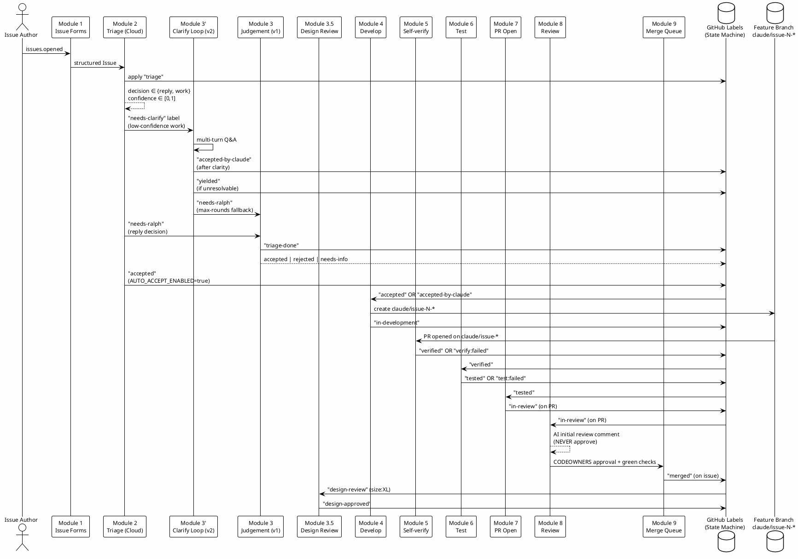
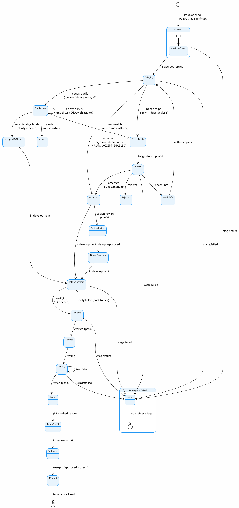

# GithubAutoDev 项目全流程深度分析

> 分析日期：2026-07-08
> 分析对象：https://github.com/akushonkamen/github-auto-dev-scaffold
> 分析者：Claude Code (CGAO 团队)

---

## 目录

1. [项目概览](#1-项目概览)
2. [核心设计理念](#2-核心设计理念)
3. [架构全景](#3-架构全景)
4. [10 模块流水线详解](#4-10-模块流水线详解)
5. [标签状态机 — 核心协议层](#5-标签状态机--核心协议层)
6. [Composite Action 设计模式](#6-composite-action-设计模式)
7. [安全模型 — S1 到 S7 红线](#7-安全模型--s1-到-s7-红线)
8. [引擎架构](#8-引擎架构)
9. [v1/v2 共存策略](#9-v1v2-共存策略)
10. [上下文预算管理](#10-上下文预算管理)
11. [失败降级与韧性设计](#11-失败降级与韧性设计)
12. [本地脚本层 (Legacy)](#12-本地脚本层-legacy)
13. [测试与质量保障](#13-测试与质量保障)
14. [与 CGAO 的对比分析](#14-与-cgao-的对比分析)
15. [可借鉴的设计模式](#15-可借鉴的设计模式)

---

## 1. 项目概览

**GithubAutoDev** 是一个基于 GitHub Actions + AI Agent (Claude Code/Codex CLI) 的 **Issue → Merge 全自动化流水线**。它采用"标签状态机"作为模块间的通信协议，将 Issue 的完整生命周期拆分为 10 个独立模块，每个模块通过 GitHub Events + Label 触发，彼此之间零直接耦合。

### 1.1 核心数据

| 维度 | 数据 |
|------|------|
| **定位** | AI-driven Issue → Merge 自动化流水线 |
| **运行平台** | GitHub Actions (云端) + 本地脚本 (兼容) |
| **AI 引擎** | Claude Code (`anthropics/claude-code-action@v1`) + Codex CLI (`openai/codex-action@v1`) |
| **模块数量** | 10 个 (含 Issue Forms 和 Merge Queue) |
| **通信协议** | GitHub Events + Label 状态机 |
| **部署方式** | GitHub Actions Workflow + Composite Actions |
| **编程语言** | Shell Script (编排层) + Markdown (Prompt 定义) |
| **核心技术** | `gh` CLI, `jq`, Claude Code CLI, `claude-code-action` |

### 1.2 与 CGAO 的差异定位

```
CGAO (我们)               GithubAutoDev (他们)
─────────────────────     ─────────────────────────
Claude Code Plugin        GitHub Actions Scaffold
MCP Server + Skills        Workflows + Composite Actions
本地 IDE 内运行             GitHub 云端运行
6 个 MCP 智能工具           8 个 Composite Actions
Skills 编排阶段              Workflows 编排阶段
Agent 定义文件               Prompt 内联在 action.yml
.cgao/ 状态文件             GitHub Labels 状态机
面向终端开发者               面向 CI/CD 自动化
```

---

## 2. 核心设计理念

### 2.1 四大架构原则

1. **Loose Coupling (松耦合)** — 模块之间仅通过 GitHub Events + Label 转换通信，绝不直接互调
2. **Label State Machine = Kanban** — 每个 Label 是一个"协议原语"，Issue 的状态完全由标签表达
3. **Engine Swap is One Variable** — Composite Action 封装引擎差异，切换 Claude ↔ Codex 只需改一个输入参数
4. **Security Red Lines Take Precedence** — 安全红线优先于任何功能需求

### 2.2 设计哲学

```
"Make the smallest change that satisfies the Issue. No drive-by refactors."
"Every module handoff is a Label transition or a GitHub event."
"Any module can be replaced without touching its neighbors."
"The protocol is mode-independent."
```

---

## 3. 架构全景

### 3.1 仓库布局

```
github-auto-dev-scaffold/
├── .github/
│   ├── workflows/          # 10 个 Workflow (每模块一个)
│   │   ├── triage-issue.yml     # Module 2: Triage
│   │   ├── clarify-loop.yml     # Module 3': Clarify Loop (v2)
│   │   ├── judge.yml            # Module 3: Judgement (v1 legacy)
│   │   ├── develop.yml          # Module 4: Develop
│   │   ├── self-verify.yml      # Module 5: Self-verify
│   │   ├── test.yml             # Module 6: Test
│   │   ├── pr-open.yml          # Module 7: PR Open
│   │   ├── review.yml           # Module 8: Review
│   │   ├── merge-queue.yml      # Module 9: Merge Queue
│   │   ├── branch-protection.yml # CI: Branch naming enforcement
│   │   └── codeql.yml           # Security: CodeQL scanning
│   ├── actions/             # 8 个 Composite Actions
│   │   ├── triage/action.yml + extract.sh
│   │   ├── clarify/action.yml + extract.sh + selfcheck.sh
│   │   ├── judge/action.yml + apply.sh
│   │   ├── design-review/action.yml
│   │   ├── develop/action.yml
│   │   ├── self-verify/action.yml + extract.sh
│   │   ├── test/action.yml + extract.sh
│   │   ├── pr-open/action.yml
│   │   └── review/action.yml
│   ├── ISSUE_TEMPLATE/      # Issue 表单模板
│   ├── labels.yml           # 标签定义 (机器可读)
│   ├── CODEOWNERS           # Review 所有权
│   └── fixtures/            # 测试 Fixtures
├── docs/                    # 协议 + 规格文档 (权威来源)
│   ├── architecture.md
│   ├── labels.md
│   ├── triage-modes.md
│   ├── composite-action-spec.md
│   ├── security.md
│   ├── quickstart-triage.md
│   └── quickstart-clarify.md
├── scripts/
│   ├── local/               # v1 本地轮询脚本 (Legacy)
│   ├── test/                # 集成测试脚本
│   └── audit/               # PAT 审计脚本
├── CLAUDE.md                # AI Agent 架构地图
├── PRD.md                   # 产品需求文档 (待放入)
└── README.md
```

### 3.2 全流水线数据流



---

## 4. 10 模块流水线详解

### Module 1 — Issue Forms (GitHub Native)

**功能**：通过结构化 Issue 模板接收用户输入

- **触发**：`issues.opened` (GitHub 原生)
- **输出**：带有 `type:bug|feature|incident` 和 `size:S|M|L|XL` 标签的结构化 Issue
- **实现**：`.github/ISSUE_TEMPLATE/bug.yml` + `feature.yml`

### Module 2 — Triage (Cloud First-pass)

**功能**：对每个新 Issue 做第一轮分析，分类为 `reply`（仅评论回复）或 `work`（需要开发）

工作流文件：`triage-issue.yml`
Composite Action：`triage/action.yml`

**核心流程**：
```
1. Fetch issue 内容 (gh issue view)
2. 构建 Claude settings JSON (permissions + maxTurns)
3. 调用 anthropics/claude-code-action@v1 (支持 GLM passthrough)
4. Parse structured_output → {decision, comment_body, suggested_labels, confidence}
5. Post comment + Apply "triage" label
6. 决策路由：
   - work + low-confidence → apply "needs-clarify" (进入 v2 clarify loop)
   - work + high-confidence + AUTO_ACCEPT_ENABLED → apply "accepted" (直接开发)
   - work + high-confidence + !AUTO_ACCEPT → recommend acceptance (等待人工)
   - reply → maintainer 人工处理
```

**安全模型**：
- `permissions: contents:read, issues:write` (S1)
- Claude allowed: `Read, Grep, Glob` only (no Bash, no Write)
- Issue body 是 untrusted input → 绝不直接写入 repo

**输出 Schema** (JSON Schema 约束)：
```json
{
  "decision": "reply|work",
  "comment_body": "string (min 10 chars)",
  "suggested_labels": ["string array"],
  "confidence": 0.0-1.0
}
```

### Module 3' — Clarify Loop (v2, Cloud)

**功能**：多轮澄清对话 — Claude 通过 Issue Comments 与作者交互，逐步细化需求

Composite Action：`clarify/action.yml`
工作流文件：`clarify-loop.yml`

**核心流程**：
```
1. Preflight Gate:
   - 仅 Issue Author 的 comments 触发 (排除 bot, PAT owner, 他人)
   - 检查 sentinel marker 防止 re-entry
   - 检查 maintainer override labels (rejected/accepted/force-manual)
2. State cross-check (AC-V2-13): label round vs hidden comment round
3. Compute round number (1→2→3)
4. Detect issue language (CJK heuristic)
5. Max-rounds check (default 3, configurable)
6. Run clarify composite → {action: ask|accept|yield, question?, reason}
7. Dispatch Shell:
   - ask → post question comment + apply "clarify-r-N"
   - accept → AC-V2-8b race check + apply "accepted-by-claude"
   - yield → apply "yielded"
   - max-rounds exhausted → apply "needs-ralph" (ralph fallback)
8. AC-V2-13a log-scan for secret leaks
```

**多轮澄清示例**：
```
Round 1: Claude asks "Which API endpoint should this use?"
  → Author replies: "GET /api/v2/users"
Round 2: Claude asks "Should pagination be cursor-based or offset-based?"
  → Author replies: "cursor-based, 50 per page"
Round 3: Claude → action=accept (clarity reached)
  → accepted-by-claude label applied
```

**关键安全控制**：
- Claude NEVER 直接 apply label → 只输出 sealed JSON
- Dispatch shell (CLAUDE_DEV_PAT) 执行 label 操作
- DENY_LIST: accepted, rejected, design-approved, needs-info, needs-clarify, triage — 绝不通过 Claude 路径写入
- AC-V2-8b: apply "accepted-by-claude" 前重新 fetch labels 检查 race condition

### Module 3 — Judgement (v1, Legacy, Maintainer-driven)

**功能**：v1 路径的人工决策 — 基于 ralph 本地工具或 Claude 的深度分析

工作流文件：`judge.yml`
Composite Action：`judge/action.yml`

**三种模式**：
| 模式 | 行为 |
|------|------|
| `auto` | Judge 直接 apply accepted/rejected/needs-info |
| `manual` | Judge 只贴建议 comment，人工 apply label |
| `hybrid` (默认) | confidence ≥ threshold → auto-apply; else manual |

**模式解析优先级**：
```
1. force-manual label present?  → manual
2. vars.TRIAGE_MODE set?        → that value
3. otherwise                    → hybrid (default)
```

**置信度阈值标定流程** (PRD §8 item 5)：
```
Step 1: 收集 50+ issues 以 manual 模式运行 (不 auto-apply)
Step 2: 人工标注 ground truth (正确决策)
Step 3: 在 t ∈ {0.5, 0.6, 0.7, 0.8, 0.9} 上计算 Precision/Recall/F1
Step 4: 选择 max F1 subject to Precision ≥ 0.85
Step 5: 更新 HYBRID_CONFIDENCE_THRESHOLD
```

### Module 3.5 — Design Review

**功能**：对 `size:XL` 的 Issue 生成设计提案，需要人审批准

- **触发**：`issues.labeled: design-review`
- **输出**：`docs/designs/issue-N.md` + `design-approved` label
- **权限**：`contents:write` (仅写入 `docs/designs/`)

### Module 4 — Develop

**功能**：创建 feature branch、实现代码、提交变更

工作流文件：`develop.yml`
Composite Action：`develop/action.yml`

**核心流程**：
```
1. Preflight:
   - Gate on label == accepted OR accepted-by-claude
   - Issue must be OPEN, no rejected/force-manual
   - Compute branch name: claude/issue-N-<slugified-title>
2. Develop:
   - Checkout base branch (NEVER main/master)
   - Create head branch
   - Run Claude with Write+Edit+Bash(Git) allow
   - Claude implements changes + commits
3. Push + PR:
   - Embed CLAUDE_DEV_PAT in git extraheader
   - git push origin <head-branch>
   - gh pr create (PR author = PAT owner)
   - Audit comment on issue
4. Label transition: accepted/accepted-by-claude → in-development
```

**关键安全控制**：
- S3 守卫：拒绝 base = main/master
- Claude denied: `git push*`, `git checkout main*`, `git reset --hard*`
- 沙箱不绕过：不传 `--dangerously-skip-permissions`
- CLAUDE_DEV_PAT 用于 push/PR（规避 GITHUB_TOKEN 不能触发下游 workflow 的限制，即 PR #16 教训）

### Module 5 — Self-verify

**功能**：验证实现是否满足 Issue 的 Acceptance Criteria

工作流文件：`self-verify.yml`
Composite Action：`self-verify/action.yml`

**核心流程**：
```
1. 触发: PR opened/synchronize on claude/issue-* → dev
2. Fetch issue body + PR diff
3. Run Claude (Read/Grep/Glob ONLY, no Bash, no Write)
4. Emit sealed JSON: {verify_status, verify_report, failures}
5. Label transition: verifying → verified | verify:failed
6. Post audit comment with report
```

**S5 执行**：
- allow: `Read, Grep, Glob`
- deny: `Bash, Write, Edit` (write 全部 block)
- `--disallowedTools 'Bash(git *),Bash(*),Write,Edit'`

### Module 6 — Test (v2 Amended)

**功能**：运行现有测试套件，检查 Acceptance Criteria 覆盖率

工作流文件：`test.yml`
Composite Action：`test/action.yml`

**v2 修订 (2026-07-07)**：
- 原方案：Codex (out-of-distribution 测试，不同模型族)
- 修订方案：第二个隔离的 Claude Code 进程（因为 maintainer 无法配置 OPENAI_API_KEY）
- 保留：进程隔离、不同 prompt framing、工具限制
- 损失：严格 OOD 测试（同模型族共享训练偏差）

**Module 6 与其他模块的权限差异**：
```
Module 4 (Develop):  allow {Read, Write, Edit, Bash(Git)}
Module 5 (Verify):   allow {Read, Grep, Glob}
Module 6 (Test):     allow {Read, Grep, Glob, Bash}  ← 需要 Bash 运行测试
Module 7 (PR Open):  allow {Read, Grep, Glob, Bash(gh pr:*)}
Module 8 (Review):   allow {Read, Grep, Glob, Bash(gh pr:*)}
```

**输出 Schema**：
```json
{
  "test_status": "passed|failed",
  "test_report": "string (max 2000 chars)",
  "failures": ["string array"],
  "coverage_gaps": ["string array"]
}
```

### Module 7 — PR Open

**功能**：标记已有 PR 为"ready for review"（不创建新 PR！）

工作流文件：`pr-open.yml`
Composite Action：`pr-open/action.yml`

**核心流程**：
```
1. 触发: issues.labeled: tested
2. Discover PR from issue comments (search "PR:" link)
3. Locate existing PR by head branch
4. Post ready-for-review comment on PR
5. Apply "in-review" label to PR (NOT issue — issue stays "tested")
6. Audit comment on issue
```

**关键约束**：
- **绝对不创建新 PR** — 如果找不到已有 PR，报错 exit
- **绝对不 approve** — 最终批准是人 (PRD §6)
- `gh pr create` 被 prompt guard 禁止

### Module 8 — Review

**功能**：AI 初始 Review，生成结构化 findings 作为 PR comment

工作流文件：`review.yml`
Composite Action：`review/action.yml`

**Review 维度** (7 维度检查)：
| 检查项 | 描述 |
|--------|------|
| S1 (permissions) | 权限是否符合安全红线 |
| S2 (accepted gate) | 是否正确门控 |
| S3 (least privilege) | 最小权限原则 |
| S4 (no token leak) | 无令牌泄露 |
| S5 (no sandbox bypass) | 无沙箱绕过 |
| S6 (PAT handling) | PAT 处理合规 |
| S7 (pipeline-fix) | 逃生舱规则 |
| Acceptance criteria | 是否满足验收标准 |
| Composite spec compliance | 是否符合 composite action 规范 |

**关键约束**：
- AI NEVER approves — 仅生成 advisory review
- Final approval = human CODEOWNER
- `gh pr review --approve` 被全局禁止

### Module 9 — Merge Queue

**功能**：自动化合并 (squash-merge)

工作流文件：`merge-queue.yml`

**Preflight Gate (5 个条件全部满足)**：
```
1. PR state = OPEN
2. PR base = dev (S3: never main)
3. PR has "in-review" label
4. PR mergeable = MERGEABLE
5. All required checks = SUCCESS:
   - check (branch-protection)
   - self-verify (Module 5)
   - test (Module 6)
   - review (Module 8)
```

---

## 5. 标签状态机 — 核心协议层

### 5.1 概念

标签是模块间通信的**唯一**协议。每个模块通过监听特定标签的变化来触发动作用，并在完成时将 Issue 转换到下一个标签。

```
"Every Label is a protocol primitive."
"Modules MUST NOT call each other directly."
"Every handoff is a Label transition or a GitHub event."
```

### 5.2 标签分类体系

| 分类 | 用途 | 所有者 | 可变性 |
|------|------|--------|--------|
| `triage:*` | 分类漏斗状态 | triage bot / maintainers | bot 可 apply; maintainers 可 remove |
| `stage:*` | Issue 生命周期阶段 | maintainers + workflow bots | 仅 workflow 可前向转换 |
| `type:*` | Issue 类别 | Issue Forms 自动 apply | maintainers 可改写 |
| `size:*` | 工作量估算 | Issue Forms / PR sizing bot | maintainers 可改写 |
| `force:*` | 全局模式 per-issue 覆盖 | maintainers only | maintainers only |
| `meta:*` | 管理性关闭 | maintainers only | maintainers only |

### 5.3 完整状态转换图



### 5.4 v2 决策映射表

| Cloud 决策 + 置信度 | Module 3' 路由 | Module 3' 动作 | 最终标签 |
|---------------------|---------------|---------------|---------|
| `work` + low conf | queue clarify loop (`needs-clarify`) | `ask` (round N) | `clarify-r-N` |
| `work` + low conf | (after round N) | `accept` | `accepted-by-claude` |
| `work` + low conf | (after round N) | `yield` | `yielded` |
| `work` + low conf | (rounds exhausted) | n/a | `needs-ralph` (唯一 v2 出路) |
| `work` + high conf | auto-accept | n/a | `accepted` |
| `reply` + any conf | v1 maintainer path | n/a | maintainer manual |

### 5.5 法定转换规则 (Invariants)

**工作流绝不能**：
- 对缺少 `triage-done` 的 Issue apply `accepted`
- 在 clarify-loop.yml dispatch shell 之外 apply `accepted-by-claude`
- 对缺少 `accepted` OR `accepted-by-claude` OR `design-approved` 的 Issue apply `in-development`
- 对未在 `in-review` AND approved AND green 的 Issue apply `merged`
- 移除 `stage:failed`（除 maintainer 操作外）

**工作流必须**：
- 每次转换 apply 精确一个标签（原子性）
- 每次转换贴 audit comment（PRD §3 Audit 不变量）
- 如果前提条件缺失，拒绝操作并记录 `stage:failed`

---

## 6. Composite Action 设计模式

### 6.1 设计目标

Composite Actions 是"引擎无关的模块包装器" — 将 Claude Code / Codex CLI 的差异封装在统一接口后面。

**目标**：切换引擎 = 改变一个输入参数
```yaml
- uses: ./.github/actions/<module>
  with:
    engine: codex           # 从 'claude' 改为 'codex'
    api-key: ${{ secrets.OPENAI_API_KEY }}  # 换 key
```

### 6.2 公共接口

每个 Composite Action 共享相同的公共输入/输出：

**公共输入**：
| 输入 | 类型 | 必需 | 默认 | 描述 |
|------|------|------|------|------|
| `repo-token` | string | yes | — | GITHUB_TOKEN |
| `engine` | string | no | `claude` | `claude` 或 `codex` |
| `api-key` | string | yes | — | 引擎对应 key |
| `model` | string | no | `""` | 模型 ID 覆盖 |
| `max-turns` | string | no | `8` | Agent turn 硬上限 |
| `context-budget-paths` | string | no | `""` | 路径允许列表 |
| `dry-run` | string | no | `false` | 干跑模式 |

**公共输出**：
| 输出 | 类型 | 描述 |
|------|------|------|
| `stage` | string | 达到的生命周期标签 |
| `audit-comment-url` | string | audit comment 的 URL |

### 6.3 内部实现模式

每个 Composite Action 遵循统一的三阶段模式：

```
┌─────────────────────────────────────────────────────┐
│ Phase 1: Fetch Context                              │
│   - gh issue/pr view --json ...                     │
│   - jq parsing → GITHUB_OUTPUT                      │
│   - Heredoc for multi-line values                   │
├─────────────────────────────────────────────────────┤
│ Phase 2: Build Config + Run Engine                  │
│   - jq -c -n → settings JSON                        │
│     { permissions: {allow, deny}, maxTurns, model }  │
│   - jq -c → schema JSON                             │
│   - anthropics/claude-code-action@v1                 │
│     with: settings, claude_args, prompt             │
│   - env: ANTHROPIC_BASE_URL (GLM 直通)              │
├─────────────────────────────────────────────────────┤
│ Phase 3: Parse + Emit Outputs                        │
│   - structured_output → jq validate                 │
│   - extract.sh 脚本解析                              │
│   - GITHUB_OUTPUT 写入                              │
└─────────────────────────────────────────────────────┘
```

### 6.4 settings JSON 结构 (v1 API)

```json
{
  "permissions": {
    "allow": ["Read", "Grep", "Glob", "Bash", ...],
    "deny": ["Write", "Edit", "Bash(git push:*)", ...]
  },
  "maxTurns": 8,
  "model": "claude-sonnet-4-6"
}
```

### 6.5 各模块权限矩阵

```
Module         allow                                       deny
──────         ─────                                       ────
Triage         Read, Grep, Glob                            Write, Edit, Bash
Clarify        Read, Grep, Glob, Bash(gh issue comment:*)  Write, Edit, Bash(gh issue edit:*), Bash(gh pr:*), Bash(gh label:*), Bash(git push:*)
Judge          Read, Grep, Glob, Bash(git log:*)           Write, Edit, Bash(git push:*), Bash(git checkout main*), Bash(git reset --hard*)
Design-review  Read, Grep, Glob, Write, Bash(git:*)        Edit, Bash(git push:*), Bash(git checkout main*), Bash(git reset --hard*)
Develop        Read, Grep, Glob, Write, Edit,              Bash(git push:*), Bash(git checkout main*), Bash(git reset --hard*)
               Bash(git status/diff/log/add/commit/...)
Self-verify    Read, Grep, Glob                            Bash, Write, Edit
Test           Read, Grep, Glob, Bash                      Write, Edit
PR Open        Read, Grep, Glob, Bash(gh pr:*)             Write, Edit, Bash(git push:*)
Review         Read, Grep, Glob, Bash(gh pr:*)             Write, Edit, Bash(git push:*)
```

---

## 7. 安全模型 — S1 到 S7 红线

安全红线优先级高于任何功能需求。如果 workflow 变更与红线冲突，红线胜出。

### S1 — Triage/Judge 工作流权限

```
permissions:
  contents: read
  issues: write
  pull-requests: read
```

- 消费 untrusted Issue body 的模块 (1, 2, 3) **绝不可有** `contents: write`
- `contents: write` 仅限下游模块 (3.5, 4, 7)，且作用域仅限于 feature branches

### S2 — `accepted` 是门控

- Module 4 (develop) **仅** 在 `labeled: accepted` 时触发
- 只有 maintainer 可以 apply `accepted`
- S2 Amendment：引入并行标签 `accepted-by-claude`（Claude 通过 clarify loop 获得 self-acceptance 能力，但 provenance 被编码在标签名称中）

### S3 — 密钥最小权限

- AI 代码绝不落地 `main`
- 每个模块仅获得所需 secrets
- Secrets map per-job，绝不在 workflow 级别

### S4 — 无令牌/密钥外泄

- 每个 AI-calling composite action 传递 `--disallowedTools` / `--allowedTools` 白名单
- Prompt 包含规则："Never print tokens, API keys, or environment variable values"
- AC-V2-13a: log-scan 在每次运行后检查日志中的 secret patterns

### S5 — 无沙箱绕过

- Codex 使用 `permission-profile: workspace-write` (NOT `danger-full-access`)
- Claude 使用 `--allowedTools` 白名单；绝不 `--dangerously-skip-permissions`
- `--bypass-sandbox` 被 CI lint 禁止

### S6 — PAT 处理 (v2)

- 仅 fine-grained PAT；Classic PATs 禁止
- 单仓库范围；最小权限
- 最长 90 天生命周期；季度轮换审计
- Log disclosure protection (AC-V2-13a)
- PAT value 绝不 commit；仅存储在 GitHub Actions secrets

### S7 — Pipeline-fix 逃生舱

"吃狗粮"规则 (Dogfooding) — 所有变更（包括 pipeline 自身的修复）必须经过 Issue→PR pipeline。唯一的例外：

- `pipeline-fix` label（maintainer 手动 apply）
- 作用域限制：`.github/workflows/` + `.github/actions/` + `docs/security.md`
- 强制 audit comment
- Branch protection 规则确保执行

---

## 8. 引擎架构

### 8.1 引擎选择

| 引擎 | 操作类型 | 默认模型 | 用途 |
|------|---------|---------|------|
| Claude Code | `anthropics/claude-code-action@v1` | Opus 4.7 (heavy) / Sonnet 4.6 (standard) / Haiku 4.5 (lookup) | Modules 2/3/4/8 (主要) |
| Codex CLI | `openai/codex-action@v1` | GPT-5 family | Module 6 (OOD tester, 已移除) |
| GLM/DeepSeek | 通过 `ANTHROPIC_BASE_URL` 直通 | deepseek-v4-pro | 成本优化路径 |

### 8.2 GLM/DeepSeek 直通架构

```
Claude Code CLI
  └─ ANTHROPIC_BASE_URL = https://api.deepseek.com/anthropic
     └─ 请求路由到 DeepSeek 的 Anthropic-compatible endpoint
        └─ 使用 DEEPSEEK_API_KEY (而不是 ANTHROPIC_API_KEY)
```

这使得项目可以在不修改代码的情况下，将引擎从 Anthropic 切到 DeepSeek（或其他提供 Anthropic-compatible API 的供应商）。

### 8.3 降级链

```
Opus → Sonnet → Haiku
(模型不可用时的自动降级；需在 audit comment 中记录)
```

### 8.4 模型配置 (Repository Variables)

```
TRIAGE_MODEL
DEVELOP_MODEL
SELF_VERIFY_MODEL
TEST_MODEL        ← 可与 DEVELOP_MODEL 不同层级（部分视角多样性）
PR_OPEN_MODEL
REVIEW_MODEL      ← 建议使用更高级别（更全面的 review）
```

---

## 9. v1/v2 共存策略

### 9.1 两条路径

```
v1 (Legacy):            v2 (Cloud):
─────────────           ──────────
Issue → triage          Issue → triage
  → needs-ralph            → needs-clarify
  → local poll.sh          → clarify-loop.yml
  → local Claude           → cloud Claude multi-turn
  → human judgement        → auto-accept or yield

隔离方式: label 分离  隔离方式: label 分离
```

### 9.2 共存契约

| 路径 | 触发标签 | 路径所有者 | 实现 |
|------|---------|-----------|------|
| v1 maintainer-driven | `needs-ralph` | local `poll.sh` (POLL_ENABLED=true) | `scripts/local/handle-triage.sh` |
| v2 cloud clarify loop | `needs-clarify` | cloud `clarify-loop.yml` | `.github/actions/clarify` composite |
| v2 max-rounds fallback | `needs-ralph` (re-emitted) | local `poll.sh` OR maintainer manual | `scripts/local/handle-triage.sh` |

**AC-V2-12b**: 如果 `POLL_ENABLED=true` 且 issue 有 `needs-clarify` 标签，`poll.sh` 跳过它。隔离是结构性的。

### 9.3 Maintainer 逃生舱

- `force-manual` → 在 preflight 中停止 v1 和 v2 路径
- `rejected` → 停止所有路径；转换为 terminal
- `accepted` → 覆盖任何 Claude 路径，强制进入 Module 4

---

## 10. 上下文预算管理

### 10.1 原则

来自 PRD §5 — AI Agent 不得读取整个 repo。读取范围由 Issue/PR body 中明确提及的目录决定。

### 10.2 实施方式

```yaml
# CLAUDE.md 中的上下文预算规则
- Read CLAUDE.md (架构地图), not the whole repo
- Cap turns via max-turns (default: 6-20 per module)
- Never raise above 30 without explicit Issue scope
- If you need a directory not named in the Issue, ASK via comment
- Prefer Grep/Glob over Read of large files
```

**Composite Action 层面**：
```yaml
context-budget-paths: ${{ vars.DEVELOP_CONTEXT_PATHS || '' }}
# Space-separated allowlist of paths the agent may read
```

### 10.3 上下文预算在各模块的具体表现

| 模块 | max-turns 默认 | 允许操作 | context 来源 |
|------|---------------|---------|-------------|
| Triage | 6 | Read, Grep, Glob | CLAUDE.md + Issue body |
| Clarify | 8 | Read, Grep, Glob, comment | Issue body + comment history |
| Judge | 8 | Read, Grep, Glob, git log | CLAUDE.md + Issue body |
| Develop | 20 | Read, Write, Commit | Issue body + context-budget-paths |
| Self-verify | 10 | Read, Grep, Glob | Issue body + PR diff (capped 8000 lines) |
| Test | 10 | Read, Grep, Glob, Bash | Issue body + PR diff (capped 8000 lines) + test suite |
| PR Open | 8 | Read, Grep, Glob, gh pr comment | PR metadata |
| Review | 12 | Read, Grep, Glob, gh pr comment | PR diff (capped 10000 lines) + reference docs |

---

## 11. 失败降级与韧性设计

### 11.1 统一失败语义

每个 Composite Action 遵循相同的失败模式：

```
1. Catch the error
2. Apply "stage:failed" label
3. Post audit comment:
   - error class
   - failing step
   - log URL
   - run URL
4. Exit non-zero → workflow on-failure job 接管
```

### 11.2 on-failure Job 模式

```yaml
on-failure:
  needs: [preflight, <module>]
  if: ${{ always() && (needs.preflight.result == 'failure' || needs.<module>.result == 'failure') }}
  runs-on: ubuntu-latest
  permissions:
    issues: write
  steps:
    - name: Mark stage:failed
      env:
        GH_TOKEN: ${{ secrets.GITHUB_TOKEN }}
        NUMBER: ${{ github.event.issue.number }}
      run: |
        gh issue edit "$NUMBER" --add-label "stage:failed" || true
        gh issue comment "$NUMBER" --body "⚠️ Module X failed. See run: $RUN_URL"
```

**关键特性**：
- `if: always()` 确保即使模块失败，on-failure 也执行
- 仅需 `issues: write` 权限（最小权限）
- 非阻塞：失败不影响其他 Issue
- 每个模块独立失败，不级联

### 11.3 PRD §6 失败降级保证

> "A failing module never blocks other issues."

### 11.4 幂等性策略

各模块的幂等性保证不同：

| 模块 | 幂等性策略 |
|------|-----------|
| Triage | 覆盖性重新生成 triage output；caller 通过 HTML marker 去重 comment |
| Judge | HTML marker 匹配 → 编辑已有 audit comment；标签转换原子性 |
| Clarify | 每轮产生新的 comment（sentinel marker），不覆盖旧轮 |
| Develop | 对已有 branch append commits；绝不 force-push |
| Self-verify | PR synchronize 时替换前次 verify report |
| Test | 重新运行替换前次 test report |
| PR Open | `gh pr edit --add-label in-review` 是幂等的 |
| Review | 每次运行贴新 review comment；历史保留作 audit trail |

---

## 12. 本地脚本层 (Legacy)

### 12.1 本地轮询栈

```
scripts/local/
├── poll.sh           # cron entry; polls for accepted + needs-ralph issues
├── handle.sh         # develop-path handler (accepted): claude + push + PR
├── handle-triage.sh  # triage-path handler (needs-ralph): claude → JSON + comment
└── README.md
```

**v2 状态**: 本地栈被保留为 **v1 reply-path fallback**。对新的设置，默认 `POLL_ENABLED=false`，使用云 pipeline。

### 12.2 轮询架构

```
cron (每 5 分钟)
  ↓
poll.sh
  ↓
gh issue list --label "accepted"  → handle.sh
gh issue list --label "needs-ralph" → handle-triage.sh
  ↓
local Claude Code (stdin/out)
  ↓
JSON output → jq parse → gh comment/label
```

### 12.3 本地 vs 云端的取舍

| 维度 | 本地 (v1) | 云端 (v2) |
|------|----------|----------|
| 部署复杂度 | 需要配置 cron + 本地 Claude | 仅需 GitHub repo variables |
| 可扩展性 | 单机瓶颈 | GitHub Actions 自动扩展 |
| 多轮对话 | 手动 (每轮都需要人去触发) | 自动 (issue_comment 事件驱动) |
| 审计 | 本地日志 | GitHub Actions run logs |
| 成本 | 本地算力 | GitHub Actions minutes |

---

## 13. 测试与质量保障

### 13.1 Fail-fast 策略

所有 `extract.sh` 脚本采用 fail-fast：
```bash
set -euo pipefail
# 验证 JSON schema → 不匹配则 exit 1 → workflow 进入 on-failure
```

### 13.2 Fixture 测试

`.github/fixtures/` 包含各种边缘情况的测试 Issue：
```
ambiguous-low-conf.md      # 模糊的低置信度 Issue
hostile-injection.md       # 敌对注入测试
malformed-json.md          # 格式错误的 JSON
rapid-fire-comments.md     # 快速连续评论
specific-bug-en.md         # 英文具体 Bug
specific-bug-zh.md         # 中文具体 Bug
stripped-hidden-comment.md # 被剥离的隐藏评论
vague-feature.md           # 模糊的功能请求
```

### 13.3 集成测试

`scripts/test/` 包含：
```
boundary-round-counter.sh  # 边界轮次计数
clarify-e2e.sh             # Clarify 端到端
coexistence-v1v2.sh        # v1/v2 共存
e2e-full.sh                # 全链路端到端
inject-prompt.sh           # Prompt 注入测试
integration-extract.sh     # extract.sh 集成
lang-detect.sh             # 语言检测
parse-clarify-state.sh     # Clarify 状态解析
workflow-logic.sh          # Workflow 逻辑测试
```

### 13.4 质量门控流程

```
Module 4 (Develop) → git commit
  → Module 5 (Self-verify): verify acceptance criteria → verified | verify:failed
    → Module 6 (Test): run test suite → tested | test:failed
      → Module 8 (Review): AI review + human approval
        → Module 9 (Merge): only when all checks green
```

---

## 14. 与 CGAO 的对比分析

### 14.1 架构对比

```
维度              CGAO                        GithubAutoDev
───               ────                        ────────────
运行环境           Claude Code IDE             GitHub Actions
入口机制           /cgao:scan, /cgao:evaluate  issues.opened → Workflow
编排方式           Skills (Markdown)            Workflows + Composite Actions
AI 调用方式        Agent (MCP tools)            GitHub Actions Step (claude-code-action)
通信协议           文件状态 (.cgao/*.json)       Label State Machine
安全隔离           MCP Server 层面              GitHub Actions Permissions + 工具白名单
扩展方式           添加 MCP tools               添加 Workflow + Composite Action
状态持久化         .cgao/ JSON files            GitHub Labels + Issue Comments
多轮对话           不支持 (单次 agent)          原生支持 (clarify loop)
失败处理           try/catch per tool           on-failure job + stage:failed
引擎切换           Agent 定义切换               engine 参数切换
配置              环境变量 + plugin.json        GitHub Repo Variables
部署              claude plugins install        git clone + repo variables 配置
```

### 14.2 CGAO 优势

1. **更轻量** — 不需要 GitHub Actions 环境，在 IDE 中直接运行
2. **更灵活** — MCP 工具可以直接访问本地文件系统
3. **更快速** — 无 workflow 启动延迟
4. **更易调试** — 在 IDE 中直接看到 agent 执行过程
5. **离线能力** — 不依赖 GitHub Actions minutes
6. **更好的 IDE 集成** — 用户可以直接看到 agent 在做什么

### 14.3 GithubAutoDev 优势

1. **全自动** — 从 Issue 到 Merge 无需任何人工干预（在 auto 模式下）
2. **多轮对话** — Clarify Loop 可以和 Issue 作者进行多轮交互
3. **更强的安全模型** — 7 条安全红线，防御深度
4. **更好的可观测性** — 每步转换有 audit comment，完整的 run logs
5. **v1/v2 共存** — 支持渐进迁移
6. **Dogfooding** — Pipeline 自身通过 Pipeline 开发
7. **协议化设计** — Label State Machine 提供清晰的接口契约
8. **失败降级** — 一个 Issue 失败不影响其他 Issue

### 14.4 互补可能性

CGAO 和 GithubAutoDev 解决的是不同层次的问题：

```
GithubAutoDev: CI/CD 层面 (全自动)
    ↓
CGAO: 开发者 IDE 层面 (交互式)
```

**互补方案**：
- CGAO 作为 developers 的手动/交互式工具（在 IDE 中使用）
- GithubAutoDev 作为 CI/CD 的全自动工具（在 GitHub Actions 中运行）
- 两者可以共享 CLAUDE.md 和 Agent 定义

---

## 15. 可借鉴的设计模式

### 15.1 对 CGAO 的建议

基于 GithubAutoDev 的分析，以下是 CGAO 可以借鉴的设计：

#### 15.1.1 标签状态机

**借鉴优先级**：⭐⭐⭐⭐⭐

CGAO 目前使用 `.cgao/*.json` 文件追踪状态。可以考虑：
- 同时使用 GitHub Labels 作为状态追踪（与文件状态双向同步）
- 标签状态机提供更好的可观测性（GitHub UI 中直接可见）
- 标签转换的 "Audit comment" 模式值得借鉴

#### 15.1.2 Composite Action 模式

**借鉴优先级**：⭐⭐⭐⭐

CGAO 的 Skills 类似于 GithubAutoDev 的 Composite Actions：
- 定义统一的 "公共接口" (输入/输出规范) — GithubAutoDev 的 COMMON 接口规范非常清晰
- 将每个 Skill 视为一个 "可替换的模块"
- 引擎切换应该是一个变量变更

#### 15.1.3 安全红线系统

**借鉴优先级**：⭐⭐⭐⭐

GithubAutoDev 的 S1-S7 安全红线系统非常值得借鉴：
- 为 CGAO 定义类似的安全红线
- 将权限分离为 `contents: read` vs `contents: write`
- 对不同的 Skill/Agent 设定不同的权限边界

#### 15.1.4 Clarify Loop (多轮对话)

**借鉴优先级**：⭐⭐⭐⭐⭐

这是 CGAO 最大的功能缺失：
- 当前 CGAO 的 triage 是单次 agent 调用
- 可以添加类似于 Module 3' 的多轮澄清机制
- 在 `/cgao:evaluate` 阶段加入多轮对话能力

#### 15.1.5 结构化输出 + Schema 验证

**借鉴优先级**：⭐⭐⭐⭐

- 所有 MCP 工具的输出应该使用 JSON Schema 约束
- 添加 `--json-schema` 类似机制的验证
- 将 extract/validate 逻辑从 prompt 中分离到代码中

#### 15.1.6 上下文预算管理

**借鉴优先级**：⭐⭐⭐

- 为 Agent 设置明确的 max-turns
- 添加路径过滤（context-budget-paths）
- 大文件使用 Grep/Glob 而非完整读取

#### 15.1.7 失败降级模式

**借鉴优先级**：⭐⭐⭐

- 每个 Skill 应该有 on-failure 处理
- 失败不应该阻止其他 Issue 的处理
- stage:failed 标签 + audit comment 模式

#### 15.1.8 测试 Fixture 系统

**借鉴优先级**：⭐⭐⭐

- 建立 CGAO 的测试 Fixture 库
- 包含各种边缘情况：注入攻击、模糊需求、中文/英文等
- 端到端集成测试

### 15.2 不建议借鉴的设计

1. **GitHub Actions 作为运行平台** — CGAO 定位是 IDE 插件，不需要迁移到 Actions
2. **Shell Script 作为主要编程语言** — CGAO 使用 TypeScript 已足够好
3. **本地轮询栈 (v1)** — 设计上就是 Legacy，不应复制
4. **vtoken/PAT 身份区分** — CGAO 不需要这个复杂度（用户在 IDE 中直接操作）
5. **过度碎片化的多个 Workflow 文件** — CGAO 的 Skills 架构更清晰

---

## 附录 A: GithubAutoDev 项目文件清单

```
核心文件:
├── CLAUDE.md                     # 架构地图 (AI Agent 第一读)
├── README.md                     # 项目概述
├── CONTRIBUTING.md               # 贡献指南

文档 (docs/):
├── architecture.md               # 流水线全景 + 模块/引擎/触发矩阵
├── labels.md                     # 标签状态机完整定义
├── triage-modes.md               # auto/manual/hybrid 模式 + 阈值标定
├── composite-action-spec.md      # 每个 composite action 的接口规范
├── security.md                   # S1-S7 安全红线操作指南
├── quickstart-triage.md          # 云端 triage 快速设置
└── quickstart-clarify.md         # v2 clarify loop 快速设置

工作流 (.github/workflows/):
├── triage-issue.yml              # Module 2: Triage
├── clarify-loop.yml              # Module 3': Clarify Loop (v2)
├── judge.yml                     # Module 3: Need Judgement
├── develop.yml                   # Module 4: Develop
├── self-verify.yml               # Module 5: Self-verify
├── test.yml                      # Module 6: Test
├── pr-open.yml                   # Module 7: PR Open
├── review.yml                    # Module 8: Review
├── merge-queue.yml               # Module 9: Merge Queue
├── branch-protection.yml         # CI: Dogfooding enforcement
├── codeql.yml                    # Security: CodeQL baseline
└── design-review.yml (?)         # Module 3.5 (引用但未见文件)

Composite Actions (.github/actions/):
├── triage/action.yml + extract.sh
├── clarify/action.yml + extract.sh + selfcheck.sh
├── judge/action.yml + apply.sh
├── design-review/action.yml
├── develop/action.yml
├── self-verify/action.yml + extract.sh
├── test/action.yml + extract.sh
├── pr-open/action.yml
└── review/action.yml

本地脚本 (scripts/):
├── local/poll.sh
├── local/handle.sh
├── local/handle-triage.sh
├── local/handle-triage-selfcheck.sh
├── local/README.md
├── test/*.sh                    # 9 个测试脚本
├── audit/pat-actions.sh
└── audit/pat-rotation-check.sh

配置:
├── .github/labels.yml           # 标签定义 (源)
├── .github/CODEOWNERS           # Review 所有
├── .github/dependabot.yml       # 依赖更新
├── .github/ISSUE_TEMPLATE/      # Issue 表单
└── .github/fixtures/            # 测试 Fixtures
```

## 附录 B: 关键术语对照

| GithubAutoDev 术语 | 解释 | CGAO 对应 |
|-------------------|------|----------|
| Label State Machine | 标签作为状态转换协议 | `.cgao/*.json` 文件状态 |
| Composite Action | 引擎无关的模块包装器 | Plugin Skill |
| Clarify Loop | 多轮澄清对话 | (无对应 — 缺失功能) |
| Audit Comment | 每次标签转换的审计注释 | (无对应) |
| Dispatch Shell | label 操作的安全边界 | (无对应) |
| Sealed JSON | 受 schema 约束的 AI 输出 | (工具返回值) |
| Dogfooding | Pipeline 自己通过 Pipeline 开发 | (无对应) |
| S1-S7 | 7 条安全红线 | (无对应) |
| Engine Swap | 通过参数切换 AI 引擎 | Agent 定义切换 |
| Context Budget | 上下文预算管理 | (无对应) |
| stage:failed | 统一失败标签 | (无对应) |
| on-failure job | 失败后处理 job | tool handler try/catch |
| Preflight Gate | 工作流前置条件检查 | (无对应) |
| GLM Passthrough | 通过 ANTHROPIC_BASE_URL 切换后端 | (无对应) |
